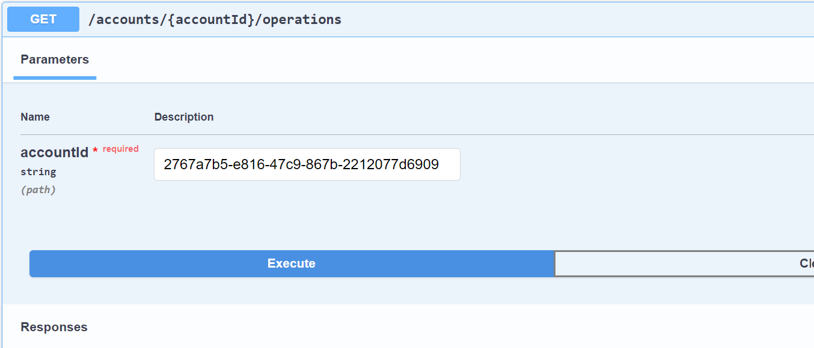

# 
 Partie Backend de l'application web Digital Banking 

***
**Ce rapport présente la partie backend de l'application web "Digital Banking" dédiée à la gestion des comptes bancaires. L'application est développée en utilisant le framework Spring Boot, reconnu pour sa structure robuste et son efficacité dans le développement d'applications Java. L'objectif principal de cette application est de permettre la gestion des comptes bancaires des clients. Chaque compte bancaire est associé à un client et peut subir différentes opérations telles que des débits ou des crédits. Deux types de comptes sont disponibles : les comptes courants et les comptes épargne.**
***
# Architecture Backend
La partie backend de l'application Digital Banking est conçue selon une architecture en couches, ce qui permet une séparation claire des responsabilités et facilite la maintenance et l'évolutivité de l'application. Voici les principales couches de l'application backend :

**Couche DAO** : Cette couche gère l'accès aux données et comprend les interfaces JPA Repository basées sur Spring Data. Ces interfaces fournissent les opérations de base pour interagir avec les entités persistantes.

**Entités JPA** : Les entités JPA représentent les objets métier de l'application et sont mappées aux tables de la base de données. Les entités de l'application Digital Banking comprennent :

- Customer : Représente un client de la banque.

- BankAccount : Classe abstraite représentant un compte bancaire. Les sous-classes de BankAccount sont CurrentAccount et SavingAccount.

- CurrentAccount : Représente un compte courant avec une autorisation de découvert.

- SavingAccount : Représente un compte épargne avec un taux d'intérêt.

- AccountOperation : Représente une opération effectuée sur un compte bancaire.

**Couche service** : Cette couche contient la logique métier de l'application et offre des services pour effectuer des opérations sur les comptes bancaires. Elle utilise les interfaces DAO pour accéder aux données et les mappers pour convertir les entités en DTO (Data Transfer Object) et vice versa.

**DTOs** : Les DTOs sont des objets utilisés pour transférer des données entre les différentes couches de l'application. Ils permettent de définir les informations à envoyer ou à recevoir lors des appels API.

**RestController** : Les RestControllers sont des composants qui exposent les services de l'application via des API REST. Ils reçoivent les requêtes HTTP, appellent les services appropriés et renvoient les réponses aux clients.

**Exceptions métier** : Ces exceptions sont utilisées pour gérer les erreurs spécifiques à l'application. Dans l'application Digital Banking, nous avons les exceptions suivantes :

- CustomerNotFoundException : Lancée lorsque le client n'est pas trouvé.

- BankAccountNotFoundException : Lancée lorsque le compte bancaire n'est pas trouvé.

- BalanceNotSufficientException : Lancée lorsque le solde du compte n'est pas suffisant pour effectuer une opération.
***
**Ce fichier contient les deux parties du backend**
***

<h3> 1. - Partie 1 : Creation du projet </h3>
- Diagramme de classe 
 
- La base de données
  

<h2>**- Technique**</h2>

<h3>- les entités et les interfaces JPA</h3>
- @Entity JPA Entities
  Les entités JPA de l'application sont annotées avec @Entity pour les identifier comme entités persistantes. La classe abstraite BankAccount utilise l'annotation @Inheritance(strategy = InheritanceType.JOINED) pour spécifier une stratégie d'héritage de type "JOINED". Cela signifie que les sous-classes CurrentAccount et SavingAccount auront leurs propres tables distinctes, mais seront liées à la table de la classe BankAccount par une clé étrangère.
- @Repository
  Les interfaces DAO de l'application utilisent l'annotation @Repository pour indiquer à Spring qu'il s'agit de composants de persistance qui gèrent l'accès aux données. Ces interfaces étendent les interfaces JPA Repository de Spring Data, telles que JpaRepository ou CrudRepository, et fournissent des méthodes pour effectuer des opérations de base sur les entités.

 

<h3> 2. - Partie 2 : Couche service, DTOs et RestController </h3>
- Les couches (dtos, mappers, services, web)
  - @Service
   Les classes de service de l'application utilisent l'annotation @Service pour indiquer qu'elles contiennent la logique métier de l'application. Ces classes utilisent les interfaces DAO pour accéder aux données et effectuer des opérations sur les entités. Elles peuvent également utiliser des mappers pour convertir les entités en DTOs et vice versa.

  - @RestController
   Les RestControllers de l'application utilisent l'annotation @RestController pour indiquer qu'ils sont des composants qui exposent les services de l'application via des API REST. Les méthodes de ces classes sont annotées avec des annotations telles que @GetMapping, @PostMapping, @PutMapping, etc., pour spécifier les points de terminaison des API et les opérations HTTP correspondantes.

   - @ExceptionHandler
   Les RestControllers utilisent également l'annotation @ExceptionHandler pour gérer les exceptions spécifiques à l'application. Ces méthodes sont annotées avec des types d'exception spécifiques, tels que @ExceptionHandler(CustomerNotFoundException.class), et renvoient les réponses d'erreur appropriées aux clients.
   
***
<h3> - Liste des clients </h3>

***
<h3> - Ajouter un client</h3>

***
<h3> - Modifier un client à l'aide de son ID</h3>

***
<h3> - Supprimer un client à l'aide de son ID</h3>

***
<h3> - BankAccountRestAPI </h3>

***
<h3> - la couche web (BankAccount) : </h3>

***
<h3> - Afficher les comptes : </h3>

***
<h3> - Afficher les operations pour chaque compte : </h3>

